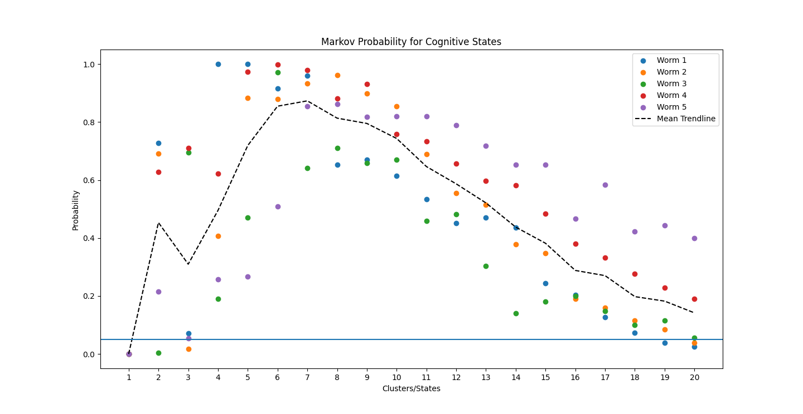

# NC-MCM-Visualizer 

## A toolbox to visualize neuronal imaging data and apply the NC-MCM framework to it

This is a toolbox uses neuronal & behavioral data and visualizes it. The main functionalities include: 
- creating different diagnostic plots and fitting a models on the data
- clustering datapoints into cognitive clusters using behavioral probability trajectories 
- testing and plotting probability of the cognitive sequence being a markov process of 1st order
- creating 3D visualizations using different sklearn dimensionality reduction algorithms as mappings
- the possibility to create a neural manifold using custom BunDLeNet's or any other mapping added
- creating movies and plots of behavioral/neuronal trajectories using the 3D mapping

## These are some of the plots created from calcium imaging data of C. elegans

<iframe src="data/plots/Demo_worm3_c4.html" width="100%" height="500" ></iframe>
# alt="Worm 3 with 4 cognitive states"
