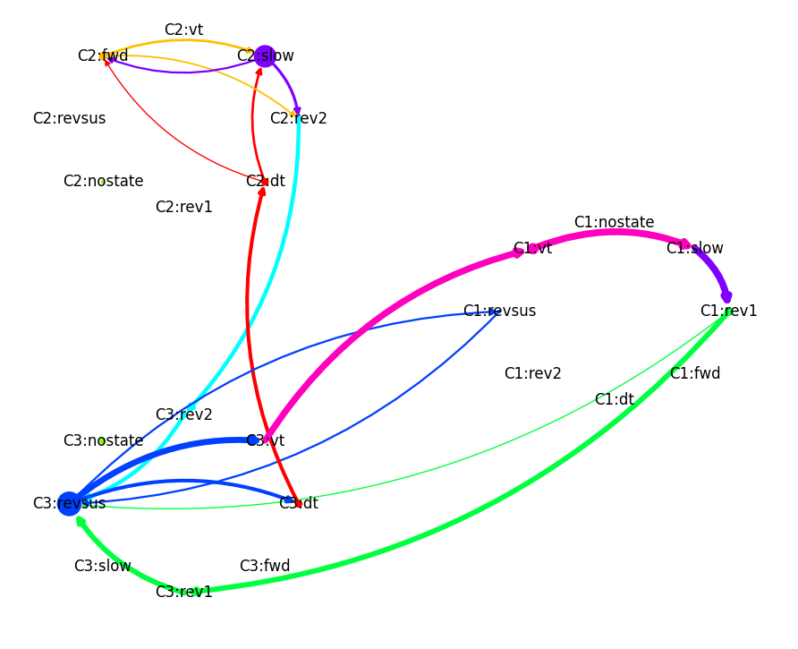
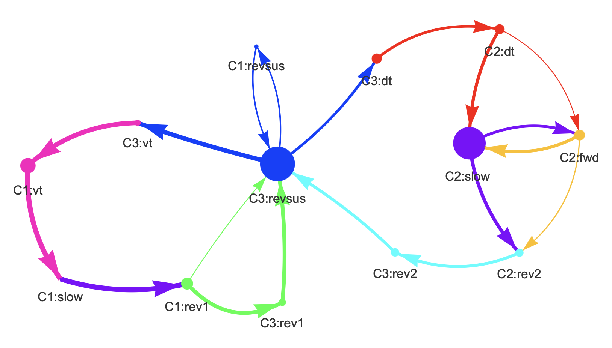
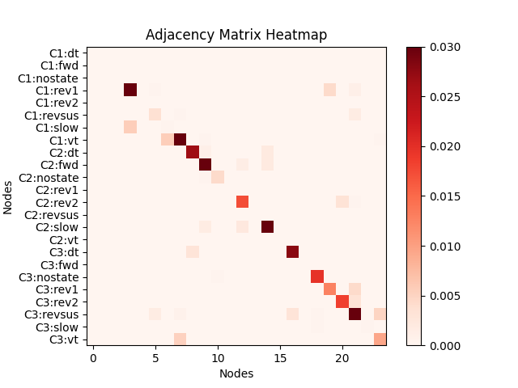
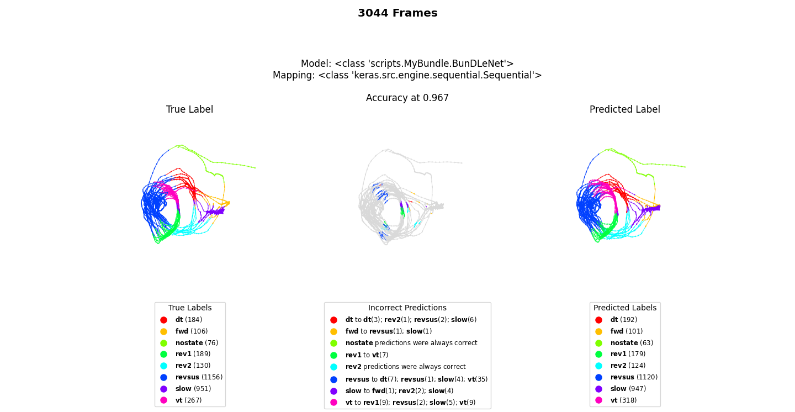

# NC-MCM-Visualizer 

## A toolbox to visualize neuronal imaging data and apply the NC-MCM framework to it

This is a toolbox uses neuronal & behavioral data and visualizes it. The main functionalities include: 
- creating different diagnostic plots and fitting a models on the data
- clustering datapoints into cognitive clusters using behavioral probability trajectories 
- testing and plotting probability of the cognitive sequence being a markov process of 1st order
- creating 3D visualizations using different sklearn dimensionality reduction algorithms as mappings
- the possibility to create a neural manifold using custom BunDLeNet's or any other mapping added
- creating movies and plots of behavioral/neuronal trajectories using the 3D mapping

## These are some of the plots created from calcium imaging data of C. elegans
#### Mean probability of being a 1st order markov process for all 5 worms at different amounts of cognitive states (30 reps)

#### Behavioral state diagram for worm 3 and 3 cognitive states

#### Interactive behavioral state diagram for worm 3 and 3 cognitive states (saved as a .html file)

#### Behavioral state adjacancy matrix for worm 3 and 3 cognitive states

#### Comparison of predicted and true label using BunDLeNet's tau model as mapping and its predictor

#### Movie using BunDLeNet's tau model as mapping and the true labels

